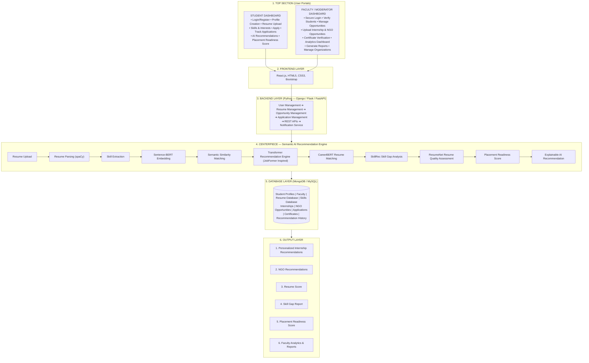

# System Requirements Specification & Architecture (PRD)
## Project Name: `semantic-talent-align`
### Framework: Semantic-Aware Intelligent Opportunity & Talent Alignment Framework (SAIOTAF)

---

## 1. Introduction

### 1.1 Purpose
This document defines the functional, technical, and design requirements for the Student Dashboard — the primary user-facing module through which students interact with the platform to build profiles, discover internship/NGO opportunities, apply, track progress, and receive AI-driven career guidance.

### 1.2 Scope & Module Ownership
> [!IMPORTANT]
> **Project Scope Boundaries**: This implementation specifically delivers the **Student Dashboard Module** (Top Section Left, Student Frontend, Student Backend Services, and Student-Facing AI & Database Outputs). 
> The *Faculty / Moderator Dashboard* is documented for system architecture context but is **Out of Scope** for this specific build.

The Student Dashboard sits at the top of the system architecture (User Portal layer) and communicates with:
* **Frontend Layer** (React.js, HTML5, CSS3, Vanilla CSS) for rendering student interfaces
* **Backend Layer** (Python — Django / Django REST Framework) via REST APIs for student business logic
* **Semantic AI Recommendation Engine** for personalized recommendations, resume scoring, and readiness scoring
* **Database Layer** (MySQL / SQLite fallback) for persistent storage of profiles, resumes, applications, and recommendation history

### 1.3 Out of Scope
* **Faculty/Moderator Dashboard functionality** (Teacher verification interface, Faculty Analytics & Reports, Certificate verification engine — managed in a separate module)
* **Internal ML model training pipelines** (consumed as a service via API endpoints)
* **Payment/monetization features** (not part of current architecture)

---

## 2. Goals & Objectives

| Goal | Description |
| :--- | :--- |
| **G1** | Provide a seamless onboarding experience for students to create verified profiles |
| **G2** | Enable structured resume upload and parsing for downstream AI processing |
| **G3** | Surface personalized, explainable internship/NGO recommendations |
| **G4** | Allow students to track applications end-to-end with real-time status |
| **G5** | Quantify and visualize a student's "Placement Readiness Score" |
| **G6** | Reduce manual effort in matching students to relevant opportunities |

### Success Metrics (KPIs)
* % of students completing profile setup within first session
* Average resume parsing success rate (target: >95%)
* Click-through rate on AI-recommended opportunities
* Application completion rate (started vs. submitted)
* Average Placement Readiness Score improvement over time
* Time-to-first-recommendation after resume upload (target: <10s)

---

## 3. User Personas

| Persona | Description | Key Needs |
| :--- | :--- | :--- |
| **New Student** | First-time user, no profile yet | Simple onboarding, clear guidance |
| **Active Applicant** | Has profile, actively applying | Fast search, application tracking, notifications |
| **Passive Browser** | Exploring options, low engagement | Strong recommendations to re-engage |
| **Graduating Student** | Near placement deadline | Readiness score, skill gap closing, urgency-driven UI |

---

## 4. Functional Requirements

### 4.1 Onboarding Module
#### FR-1: Login / Register
* Support email/password registration and login
* Institutional email domain validation (e.g., restrict to college domain if required)
* Password reset via OTP/email link
* JWT/session-token based authentication, integrated with Backend User Management service
* Optional: SSO with institutional ID (future scope)

**Acceptance Criteria:**
* User cannot access dashboard without verified login
* Invalid credentials show inline error without page reload
* Session expires after configurable inactivity period

#### FR-2: Profile Creation
* Fields: Name, Roll No./Student ID, Department, Year, CGPA, Contact Info, LinkedIn/GitHub (optional)
* Profile completion progress bar (e.g., "60% complete")
* Data validation (required fields, format checks)
* Data persisted to Student Profiles collection in Database Layer

**Acceptance Criteria:**
* Profile cannot be marked "complete" without mandatory fields
* Changes auto-save or prompt explicit save confirmation

#### FR-3: Resume Upload
* Accept PDF/DOCX formats (size limit, e.g., 5MB)
* Upload triggers Backend Resume Management pipeline
* File stored in Resume Database; async trigger to AI Engine's Resume Parsing (spaCy) step
* Display parsing status: Uploaded → Parsing → Parsed → Error
* Allow resume replacement/versioning (keep history)

**Acceptance Criteria:**
* Unsupported file types rejected with clear message
* Parsing failure shows retry option and human-readable error
* Parsed data (skills, experience, education) shown back to student for confirmation/edit

#### FR-4: Skills & Interests
* Manual skill tagging (autocomplete from Skills Database)
* Auto-suggested skills from parsed resume (editable/removable)
* Interest categories (e.g., Software Dev, Data Science, Social Work/NGO, Marketing)
* Feeds into Skill Extraction and Semantic Similarity Matching steps of AI pipeline

**Acceptance Criteria:**
* Student can add/remove skills post auto-suggestion
* Minimum skill count enforced before recommendations are generated (e.g., ≥3)

---

### 4.2 Core Student Services

#### FR-5: Apply (to Opportunities)
* Browse internships/NGO opportunities (list + filter/search: domain, location, duration, stipend, mode)
* Opportunity detail view: description, eligibility, deadline, organization info
* One-click apply using existing profile/resume (no repeated data entry)
* Application confirmation with unique application ID

**Acceptance Criteria:**
* Duplicate applications to the same opportunity are prevented
* Application triggers entry into Application Management pipeline and Applications DB table
* Deadline-passed opportunities are disabled from applying

#### FR-6: Track Applications
* Dashboard view listing all applications with status: Applied → Under Review → Shortlisted → Interview → Selected/Rejected
* Status updates sourced from Backend Application Management service (possibly updated by Faculty/Moderator side)
* Filters: by status, date, organization
* Notifications on status change (via Notification Service)

**Acceptance Criteria:**
* Status changes reflect within defined SLA (e.g., real-time or next page load)
* Each application entry links back to original opportunity detail

#### FR-7: AI Recommendations
* Personalized list of recommended internships/NGO opportunities
* Powered by: Sentence-BERT Embedding → Semantic Similarity Matching → Transformer Recommendation Engine (JobFormer-inspired) → CareerBERT Resume Matching
* Each recommendation shows a match score and explainability snippet (e.g., "Matched due to: Python, Data Analysis, Machine Learning")
* Refreshes when profile/resume/skills are updated

**Acceptance Criteria:**
* Recommendations load within acceptable latency (target <2–3s after cache; <10s cold)
* Explainable AI output is human-readable, not raw model scores
* Empty state handled gracefully (e.g., "Add more skills to get better matches")

#### FR-8: Placement Readiness Score
* Composite score (0–100) computed from: 
  * Resume Quality Assessment (ResumeNet)
  * Skill Gap Analysis (SkillRec)
  * Application activity & outcomes
* Visual representation (gauge/radar chart) with breakdown by category
* Actionable suggestions to improve score (e.g., "Add certifications," "Close gap in Cloud Computing")

**Acceptance Criteria:**
* Score recalculates on resume update, skill update, or periodic backend job
* Breakdown view shows category-wise sub-scores, not just the aggregate

---

## 5. Non-Functional Requirements

| Category | Requirement |
| :--- | :--- |
| **Performance** | Dashboard initial load < 3s; API responses < 1s for non-AI endpoints |
| **Scalability** | Support concurrent usage by entire student cohort during peak (e.g., placement season) |
| **Security** | Encrypted storage of resumes/PII; role-based access control; HTTPS everywhere |
| **Availability** | 99% uptime target during academic/placement cycles |
| **Usability** | Mobile-responsive; WCAG-AA accessibility basics |
| **Data Privacy** | Compliance with institutional data policies; student consent for resume sharing |
| **Maintainability** | Modular REST API consumption; frontend components reusable across dashboard sections |

---

## 6. System Architecture (6-Tier Framework)

---

## 7. Data Requirements (Student-Facing Entities)

| Entity | Key Fields |
| :--- | :--- |
| **Student Profile** | `student_id`, `name`, `dept`, `year`, `CGPA`, `contact`, `profile_completion_%` |
| **Resume** | `resume_id`, `student_id`, `file_url`, `parsed_skills`, `parsed_experience`, `version`, `status` |
| **Skills** | `skill_id`, `skill_name`, `category`, `proficiency` |
| **Application** | `application_id`, `student_id`, `opportunity_id`, `status`, `applied_date`, `last_updated` |
| **Recommendation History** | `student_id`, `opportunity_id`, `match_score`, `explanation`, `generated_date` |
| **Readiness Score** | `student_id`, `overall_score`, `resume_score`, `skill_gap_score`, `timestamp` |

---

## 8. UI/UX Requirements

* **Navigation**: Persistent sidebar/topbar with sections — Home, Profile, Resume, Opportunities, Applications, Recommendations, Readiness Score
* **Home/Overview**: Snapshot cards — Profile completion %, Readiness Score, Pending applications, New recommendations
* **Empty/Error states**: Clear, actionable messaging (not generic errors)
* **Notifications**: Bell icon with dropdown, badge count for unread updates
* **Responsive Design**: Fully usable on mobile/tablet
* **Explainability UI**: Recommendation cards must show why a match was suggested, not just a score

---

## 9. API Contract Specification (Student-facing endpoints)

**Base URL**: `/api/v1/student/`  
**Auth**: Bearer token (JWT) required on all endpoints unless noted.

### 9.1 Authentication
| Method | Endpoint | Description |
| :--- | :--- | :--- |
| `POST` | `/auth/register` | Register new student (email, password, roll_no) |
| `POST` | `/auth/login` | Login, returns JWT + refresh token |
| `POST` | `/auth/reset-password` | Trigger OTP/email reset flow |

### 9.2 Profile
| Method | Endpoint | Description |
| :--- | :--- | :--- |
| `GET` | `/profile/{student_id}` | Fetch profile data + completion % |
| `PUT` | `/profile/{student_id}` | Update profile fields |

### 9.3 Resume
| Method | Endpoint | Description |
| :--- | :--- | :--- |
| `POST` | `/resume/upload` | Multipart upload; triggers async parsing job |
| `GET` | `/resume/{student_id}/status` | Poll parsing status: parsing / parsed / failed |
| `GET` | `/resume/{student_id}/parsed-data` | Returns extracted skills/experience for review |

### 9.4 Skills
| Method | Endpoint | Description |
| :--- | :--- | :--- |
| `GET` | `/skills/suggestions?student_id=` | Returns auto-suggested skills post-parsing |
| `POST` | `/skills/{student_id}` | Save confirmed/edited skill list |

### 9.5 Opportunities & Applications
| Method | Endpoint | Description |
| :--- | :--- | :--- |
| `GET` | `/opportunities?domain=&location=&stipend_min=` | Filtered opportunity listing |
| `GET` | `/opportunities/{id}` | Opportunity detail view |
| `POST` | `/applications` | Submit application {student_id, opportunity_id} |
| `GET` | `/applications/{student_id}` | List all applications + status |

### 9.6 AI Recommendation Engine (proxied via Backend)
| Method | Endpoint | Description |
| :--- | :--- | :--- |
| `GET` | `/recommendations/{student_id}` | Returns ranked opportunities + match_score + explanation |
| `GET` | `/readiness-score/{student_id}` | Returns overall + sub-category readiness scores |
| `GET` | `/skill-gap/{student_id}` | Returns missing skills vs. target roles |

### 9.7 Notifications
| Method | Endpoint | Description |
| :--- | :--- | :--- |
| `GET` | `/notifications/{student_id}` | Fetch unread + recent notifications |
| `PUT` | `/notifications/{id}/read` | Mark notification as read |

---

## 10. Acceptance Test Scenarios

| Test ID | Scenario | Expected Result |
| :--- | :--- | :--- |
| **TC-01** | Student uploads a corrupted PDF | System rejects with error, no crash, retry option shown |
| **TC-02** | Student applies to same opportunity twice | Second attempt blocked with "Already Applied" message |
| **TC-03** | Resume parsing takes >30s | UI shows persistent "still processing" state, not a timeout error |
| **TC-04** | Student has 0 skills tagged | Recommendations screen shows empty-state prompt instead of blank/error |
| **TC-05** | Application status changes on backend | Notification appears within SLA and application list auto-updates |
| **TC-06** | Student updates resume | Readiness Score and Recommendations recalculate and refresh |
